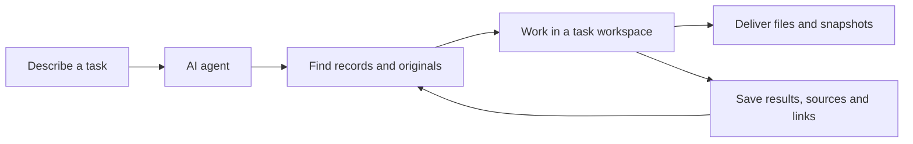

# Personal Workbench

**Let your AI agent put your information to work.**

[简体中文](README.md) · [Agent entry point](AGENTS.md) · [Workflows](system/docs/OPERATIONS.md) · [MIT](LICENSE)

Personal Workbench is a local, agent-operated workspace for personal information. It keeps records, documents, projects, and outputs searchable and traceable, so your agent can reuse existing material across tasks with less repeated questioning and manual organization.

**You describe what you need. Your agent finds the information, does the work, and saves the results in a searchable form.**

The agent is the only intended user-facing entry point. You do not need to learn database commands, design tables, or maintain indexes. The repository's CLI and Python API are tools for the agent; the repository does not depend on Codex-specific interfaces. You are welcome to try other agents capable of executing local tools; compatibility has not been verified.

## Example use cases

### Build a personal archive of university notices

> “Archive all university notices and their necessary attachments from the past three years.”

Your agent retrieves material within the requested scope and stores the text, sources, dates, and attachments. You can then ask, “When does course pre-registration open, and what steps do I need to follow?” or “What notices has the university published about this competition?”

Search returns material and evidence locations for the agent to read and compare. Collection progress is recorded, along with any unfinished work and the reasons it remains incomplete.

### Reuse confirmed information when filling out forms

> “Use the information I have saved to fill out this application form.”

Names, education history, contact details, and other saved fields can be retrieved instead of repeatedly requested. Fields retain their sources, status, and revision history. The agent checks missing, conflicting, or uncertain values. Its document tools perform the actual editing; submission follows your instructions.

### Give resumes, reports, and research tasks a workspace

> “Use my existing experience to make a resume in LaTeX. Give me the PDF and source.”

The agent creates a dedicated `workspaces/<task-directory>/` for source files, tools, and output checks. Important results can be archived, linked to projects, and indexed. Deliveries group files for easy use while preserving independent historical batches.

LaTeX, browsers, Office tools, and OCR are supplied by your agent and local environment. The workbench manages information, task locations, relationships, versions, and deliveries; it does not bundle those external applications.

## A workflow that keeps building on previous work



| Capability | What the workbench provides |
| --- | --- |
| Archiving | Original versions, hashes, and sources; text extraction for formats such as text files, HTML, PDF, DOCX, and XLSX |
| Retrieval | Full-text and structured queries; filters for domain, authority, topic, history, and item type; supplemental matching for short Chinese terms |
| Personal information | Typed fields, confirmation status, and revision evidence for precise reuse |
| Projects and workspaces | Registered external locations or new local task directories, with aliases and relationships |
| Revisions | Revision checks before updates and retained change history to prevent stale overwrites |
| Deliveries | Flat output directories, themed ZIPs, manifests, and independent historical batches |
| Backup and recovery | On-demand database and managed-file backups, verified before restoration into a new directory |

The agent handles natural-language understanding, query reformulation, collection, and document creation. The workbench uses SQLite and ordinary files, runs on demand, makes no model API calls, and requires no background service.

## Get started by giving the repository to your agent

On a Windows x64 computer with Codex and Python (including pip), choose a new local directory and give Codex (or another agent) this request:

> Clone https://github.com/w1379/personal-workbench into the new directory I specify. Read AGENTS.md at the repository root and follow system/docs/SETUP.md to install and initialize an empty workbench. Do not import personal material from other directories. Tell me when it is ready to use.

The agent installs an isolated project runtime, checks SQLite full-text search, initializes an empty database, and verifies the entry point. Then make requests such as:

- “Remember this decision and record today's evidence.”
- “Archive this file and link it to this project.”
- “Find what I already have, then help me write this report.”
- “List the todos I explicitly added.”

The current validation scope is **Windows x64**; other systems have not been verified.

## Where information lives

```text
personal-workbench/
├── AGENTS.md            # Agent rules and navigation
├── system/              # Code, schemas, tests, and operating documentation
├── data/
│   ├── library.sqlite3  # Records, fields, links, history, and search indexes
│   └── originals/      # Archived original versions
├── workspaces/          # Task drafts, scripts, and intermediate results
├── exports/
│   ├── current/        # Most recent delivery
│   └── history/        # Independent delivery snapshots
└── backups/             # On-demand full backups
```

Data directories are created during initialization or use. The repository contains software, documentation, and fictional examples, **not the author's personal database or files**. `.gitignore` excludes personal data, workspaces, deliveries, backups, and the runtime. Local maintenance notes can go in the ignored `HANDOFF.local.md`.

Pushing code to GitHub does not back up personal content. A full backup includes the authoritative SQLite database, originals, and irreplaceable working files; external projects are registered by location only by default.

Your information is stored locally. Whether the agent sends relevant content to cloud services while working depends on how it runs and is configured.

## Current boundaries

- This is a local work system, not a web app or unattended assistant. There is no background collection, automatic reminder service, or whole-computer scanning.
- Retrieval covers saved material and does not guarantee that it reflects the latest source updates. You can ask the agent to update it on demand—for example, “Add university notices and attachments published since the previous collection date.” The agent can archive and index the new material. Your information can keep growing and stay up to date through these updates; the workbench simply does not synchronize with source websites automatically in the background.
- There is currently no vector search or embedding service.
- Ingestion typically follows three steps: save the original, extract its text, and build the search index. HTML bodies, plain text, and PDFs with a text layer usually allow direct extraction; the repository includes basic extraction tools for the agent to call. Text in scanned PDFs and images usually requires OCR. PDFs or images embedded in a web page must also be retrieved and processed separately.
- After saving an original, the agent should complete the necessary extraction and indexing, then verify that the body is searchable. If access restrictions, recognition failures, or unsupported formats prevent completion, it should retain the originals obtained and record what remains incomplete and why, so work can resume later. A saved file must not be reported as completed full-text ingestion.
- Downloads, website adaptation, LaTeX compilation, and form editing use the agent's external tools. There is no universal website crawler.

## For maintainers and agents

| Document | Purpose |
| --- | --- |
| [AGENTS.md](AGENTS.md) | Operating rules, root boundaries, and task navigation |
| [SETUP.md](system/docs/SETUP.md) | Fresh installation, initialization, and verification |
| [OPERATIONS.md](system/docs/OPERATIONS.md) | Records, queries, fields, workspaces, and deliveries |
| [ARCHITECTURE.md](system/docs/ARCHITECTURE.md) | Authoritative data, indexes, transactions, and module responsibilities |
| [INBOX.md](system/docs/INBOX.md) | Optional explicit cross-device submissions |
| [HANDOFF.md](HANDOFF.md) | Software status, validation results, and remaining boundaries |

## License

Code and repository documentation are available under the [MIT License](LICENSE). Runtimes and third-party dependencies retain their own licenses. Material you store in the workbench is not automatically licensed under MIT.
