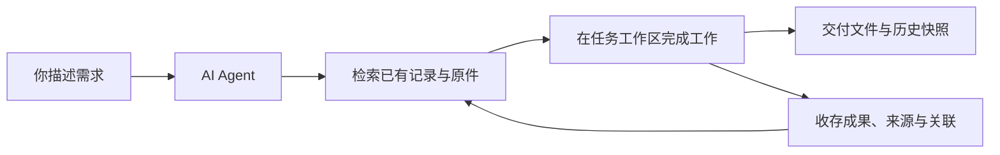

# Personal Workbench

**让 AI Agent 使用你的资料，为你完成工作。**

[English](README.en.md) · [Agent 入口](AGENTS.md) · [工作流程](system/docs/OPERATIONS.md) · [MIT](LICENSE)

Personal Workbench 是一个由 AI Agent 操作的本地个人信息工作台。它把个人信息、文档、项目和工作成果保存在可检索、可追溯的结构中，让 Agent 在后续任务中复用已有资料，减少重复询问和反复整理。

**你负责描述需求；Agent 负责查找资料、完成工作，并留下可被检索的结果。**

项目以 Agent 作为唯一面向用户的操作入口。用户不需要学习数据库命令、设计表结构或手工管理索引。仓库中的命令行工具和 Python API 是提供给 Agent 的操作工具，仓库不依赖 Codex 专有接口。其他具备本地工具执行能力的 Agent 也可由用户自行尝试，兼容性尚未验证。

## 使用场景示例

### 建立自己的学校公告资料库

> “把学校近三年的所有公告和必要附件收存下来。”

Agent 按你指定的范围取得资料，再将正文、来源、日期和附件存入工作台。你可以继续问：“预选课什么时候开始，需要按什么流程操作？”或“学校发布过哪些关于这项竞赛的通知？”

全文检索会提供资料和证据定位，Agent 再阅读、比较和回答。收录进度会明确记录，未完成的部分及原因也会说明。

### 填表时，复用已经确认的信息

> “根据我保存的信息，把这份报名表填好。”

姓名、教育经历、联系方式和其他已存字段可以直接查询和复用，避免每次重新询问。字段保留来源、状态与修订记录；缺失、冲突或不确定的内容再由 Agent 核实。具体表格的编辑由 Agent 的文档工具完成，最终提交仍遵循你的指示。

### 让简历、报告和研究任务有自己的工作区

> “用我的已有经历做一份简历，用 LaTeX 排版，给我 PDF 和源码。”

Agent 为任务建立独立的 `workspaces/<任务目录>/`，在里面编辑源码、运行工具和检查输出。重要成果可正式收存、关联到项目并进入全文检索；交付时生成便于拿取的一批文件，同时保留历史版本。

LaTeX、浏览器、Office、OCR 等能力由 Agent 及本机工具提供。工作台负责资料、任务位置、关联、版本和交付，不捆绑这些外部软件。

## 一条可以持续积累的工作流程



| 能力 | 工作台做什么 |
| --- | --- |
| 收存 | 保存原件版本与哈希，记录来源；支持文本、HTML、PDF、DOCX、XLSX 等格式的文字提取 |
| 检索 | 全文与结构化查询，可按领域、来源、主题、历史和对象类型筛选，支持中文短词补充匹配 |
| 个人信息 | 保存有类型的字段、确认状态和修改依据，供后续任务精确复用 |
| 项目与工作区 | 登记外部项目位置，或为新任务创建本地工作目录；建立别名与关联 |
| 修订 | 更新时检查 revision，保留变更历史，避免过期信息直接覆盖新值 |
| 交付 | 生成扁平交付目录、主题 ZIP 和清单，保留每批独立快照 |
| 备份与恢复 | 按需备份数据库和受管文件，校验后恢复到新目录 |

自然语言理解、查询改写、资料收集和文档制作由 Agent 完成；工作台本身使用 SQLite 和普通文件，按需运行，不调用模型 API，也没有常驻服务。

## 开始使用：把仓库交给 Agent

在一台运行 Windows x64、安装了 Codex 和 Python（含 pip）的电脑上，把下面的话交给 Codex（或其他 Agent），并选择一个新的本地目录：

> 请把 https://github.com/w1379/personal-workbench 克隆到我指定的新目录，阅读仓库根目录的 AGENTS.md，按照 system/docs/SETUP.md 完成安装并初始化一个空工作台。不要导入其他目录的个人资料。完成后告诉我是否可以开始使用。

Agent 会安装项目独立运行环境、检查 SQLite 全文检索、初始化空库并验证入口。之后直接提出需求即可，例如：

- “记住这项决定，保留今天的依据。”
- “把这个文件收存下来，关联到这个项目。”
- “先找已有资料，再帮我写这份报告。”
- “列出我明确添加过的待办。”

当前验收范围为 **Windows x64**；其他系统尚未验证。

## 资料放在哪里

```text
personal-workbench/
├── AGENTS.md            # Agent 的工作规则和导航
├── system/              # 程序、数据库结构、测试与操作文档
├── data/
│   ├── library.sqlite3  # 记录、字段、关联、历史和检索索引
│   └── originals/      # 已收存的原件版本
├── workspaces/          # 各任务的工作稿、脚本与中间成果
├── exports/
│   ├── current/        # 最近一批交付文件
│   └── history/        # 每批独立的交付快照
└── backups/             # 按需生成的完整备份
```

数据目录在初始化或使用时生成。仓库只包含软件、文档和虚构示例，**不包含作者的个人数据库或资料**。`.gitignore` 排除个人数据、工作区、交付、备份及运行环境；本地维护记录可放在忽略的 `HANDOFF.local.md`。

把代码推到 GitHub 不等于备份了个人资料。完整备份需要包含 SQLite 正本、原件和不可重建的工作材料；外部项目默认只保存位置登记。

资料保存在本机；Agent 处理任务时是否将相关内容发送到云端，取决于它的运行方式与配置。

## 先了解这些边界

- 这是本地工作系统，不是网页应用或无人值守的个人助手；没有后台采集、自动提醒或全盘扫描。
- 检索基于已保存的资料，不保证来源实时最新。你可以随时让 Agent 按需更新，例如“补充学校上次收录日期之后发布的公告和附件”，将新内容追加收存并建立索引。资料可以持续更新，只是不会在后台自动与来源网站同步。
- 目前没有向量检索或 embedding 服务。
- 收录通常包括“保存原件 → 提取文字 → 建立检索索引”。HTML 正文、纯文本和带文字层的 PDF 通常可以直接提取文字，仓库内置了供 Agent 调用的基础提取工具；扫描型 PDF 和图片中的文字通常需要 OCR 识别。网页中嵌入的 PDF 或图片也需要单独获取和处理。
- Agent 应在保存原件后继续完成必要的文字提取与索引，并核验正文是否可检索。如果访问受限、识别失败或格式暂不支持，应保留已取得的原件，明确记录未完成的部分和原因，供后续继续处理；不能把“文件已保存”当作“全文收录已完成”。
- 页面下载、网站适配、LaTeX 编译和表格填写由 Agent 调用外部工具完成，工作台没有“适用所有网站”的自动采集器。

## 给维护者与 Agent

| 文档 | 内容 |
| --- | --- |
| [AGENTS.md](AGENTS.md) | 操作原则、根目录边界与任务导航 |
| [SETUP.md](system/docs/SETUP.md) | 从空目录安装、初始化、验证 |
| [OPERATIONS.md](system/docs/OPERATIONS.md) | 日常记录、查询、字段、工作区和交付 |
| [ARCHITECTURE.md](system/docs/ARCHITECTURE.md) | 正本、索引、事务和模块职责 |
| [INBOX.md](system/docs/INBOX.md) | 可选的显式跨设备投递 |
| [HANDOFF.md](HANDOFF.md) | 软件当前状态、验证结果和待办边界 |

## 许可证

代码和仓库文档使用 [MIT License](LICENSE)。运行时和第三方依赖遵循各自许可证；你存入工作台的资料不因使用本软件而改为 MIT 授权。
